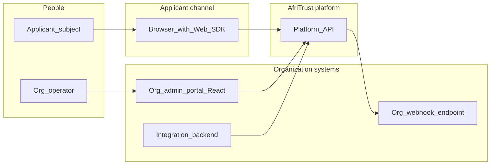
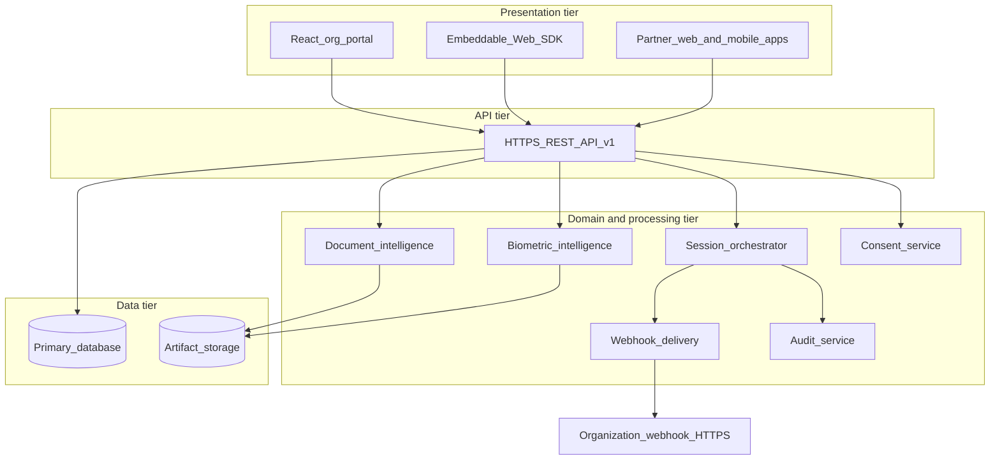
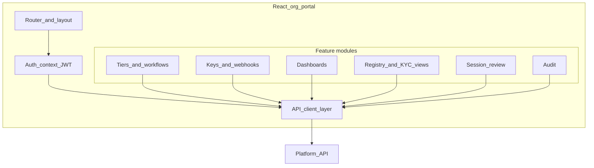
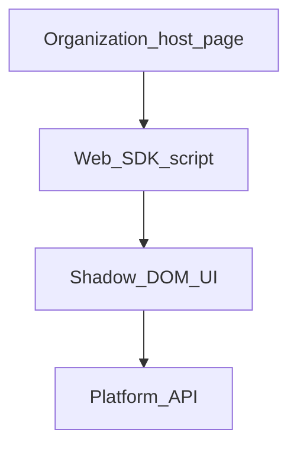
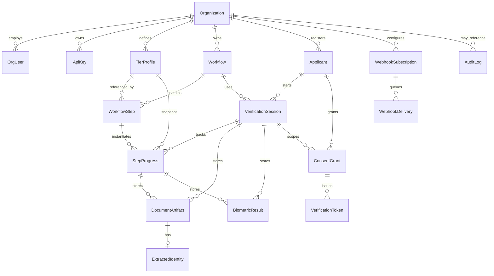
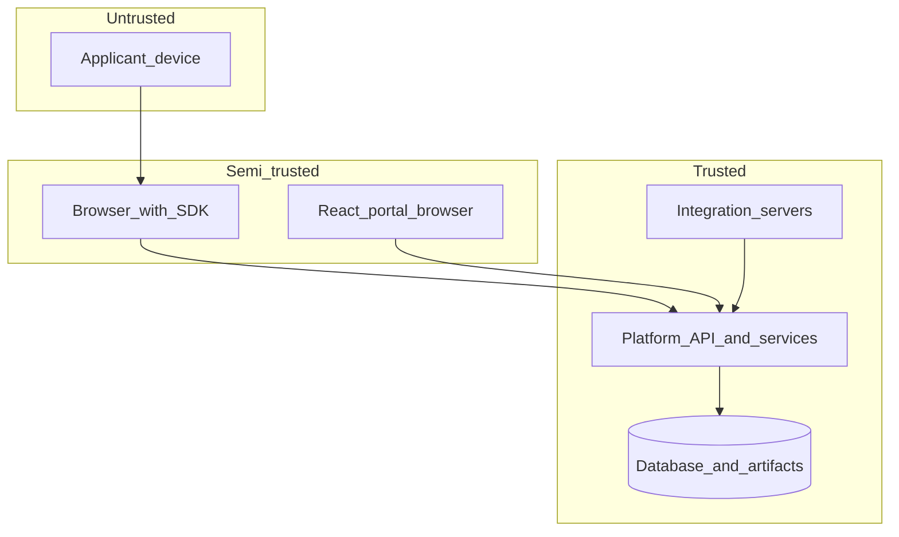
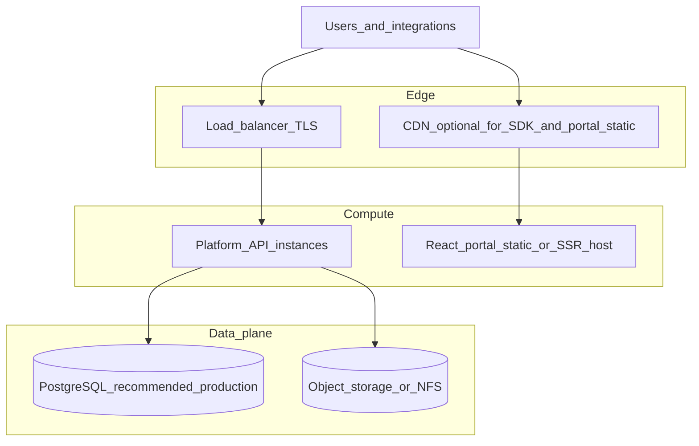
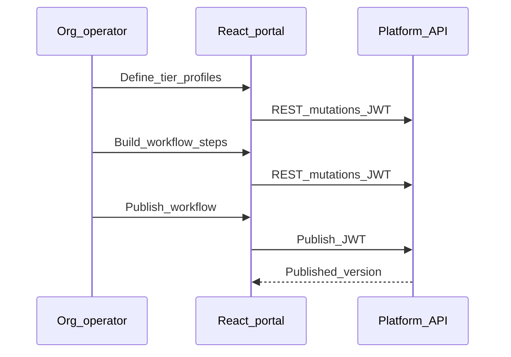
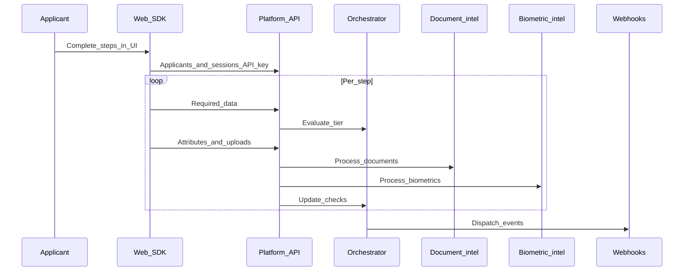

# AfriTrust — System Architecture and Design

| Field | Value |
|-------|--------|
| Document type | System architecture and design |
| Product | AfriTrust — Unified Digital Identity Infrastructure |
| Audience | Engineering, security, product, and technical operations |

---

## Abstract

AfriTrust is a **multi-tenant unified digital identity infrastructure**. Each organization operates an isolated verification program: it defines **tier profiles** (what attributes to collect and which assurance checks apply), composes them into **published workflows**, and runs **verification sessions** for **applicants** (the individuals being verified). The platform delivers **document intelligence**, **biometric assurance** (including liveness and face comparison), **orchestrated session state**, **auditability**, and **event notifications** to the organization’s own systems.

This document describes the **end-to-end system**: client applications, organization administration experience, public API, platform services, data stores, security controls, and deployment topology. It is written at the **system** level; implementation details follow the same boundaries without reference to source layout or packaging.

---

## Table of contents

1. [System overview](#1-system-overview)
2. [Architectural principles](#2-architectural-principles)
3. [System context](#3-system-context)
4. [Logical component model](#4-logical-component-model)
5. [Organization administration portal (React)](#5-organization-administration-portal-react)
6. [End-user verification channels](#6-end-user-verification-channels)
7. [Platform API](#7-platform-api)
8. [Platform services and processing](#8-platform-services-and-processing)
9. [Data architecture](#9-data-architecture)
10. [Security architecture](#10-security-architecture)
11. [Deployment and operations](#11-deployment-and-operations)
12. [Key runtime flows](#12-key-runtime-flows)
13. [Cross-cutting concerns](#13-cross-cutting-concerns)
14. [Non-functional requirements](#14-non-functional-requirements)

---

## 1. System overview

### 1.1 Product definition

AfriTrust provides **organization-scoped digital identity verification**: configurable assurance levels, dynamic data collection, document and biometric processing, session lifecycle management, and exportable outcomes for downstream risk and compliance workflows within the **organization’s** trust domain.

The platform is **not** a single centralized identity provider for the public internet; each **organization** owns its applicants, configuration, keys, and integration endpoints.

### 1.2 Major subsystems

| Subsystem | Role |
|-----------|------|
| **Organization Administration Portal** | React web application for org operators: identity for the portal (register, verify email, sign-in), configuration of tiers and workflows, API keys, webhooks, dashboards, registry search, manual review, audit visibility. |
| **Platform API** | Versioned HTTPS REST API (`/v1` namespace): authentication, authorization, and all programmatic operations for portal, integrations, and embedded flows. |
| **Web SDK** | Embeddable browser script that drives the verification UX (forms, uploads, camera) against the Platform API using an integration API key. |
| **Integration tier** | Server-side systems (mobile backends, core banking, onboarding services) that call the Platform API with API keys and optionally orchestrate sessions without the Web SDK. |
| **Persistence** | Relational database for authoritative state; object or filesystem-backed storage for uploaded artifacts; append-only audit trail. |
| **Asynchronous notifications** | Signed outbound HTTPS webhooks to URLs registered by the organization. |

---

## 2. Architectural principles

- **Multi-tenancy by design**: Every business entity is scoped to an **organization**; authorization never crosses tenant boundaries.
- **Configuration over code**: Tier definitions, attribute schemas, accepted document types, and workflow graphs are **data**, versioned with publication semantics for workflows.
- **Explicit session orchestration**: A dedicated **orchestration** component interprets tier requirements and drives **step progress** and terminal outcomes.
- **Separation of operator and integration credentials**: **Human operators** use short-lived **JWTs** after password-based sign-in; **automated integration** uses **API keys** with scopes.
- **Defense in depth**: Transport security, authentication, role checks, input validation, audit logging, and webhook signing together reduce abuse and support forensic review.
- **Channel-appropriate trust**: Browser-embedded API keys are **exposed to end-users** by nature; the architecture assumes **dedicated, least-privilege keys** for browser channels.

---

## 3. System context

External actors and systems interacting with AfriTrust.

**Narrative**

- **Org operators** configure and operate their verification program through the **React portal**.
- **Applicants** complete verification through experiences powered by the **Web SDK** (or entirely server-driven flows built by the organization).
- **Integration backends** create applicants, open sessions, poll or push state, and sync with internal systems.
- **Webhook endpoints** receive signed events for automation (CRM updates, case management, internal queues).

---

## 4. Logical component model

End-to-end layering from user-facing surfaces to infrastructure.

---

## 5. Organization administration portal (React)

The **organization administration portal** is a **single-page application built with React**. It is the primary operator interface for configuration, monitoring, registry exploration, and manual decisioning.

### 5.1 Functional domains

| Domain | Responsibility |
|--------|------------------|
| **Authentication** | Organization user registration, email verification, sign-in, session management, password lifecycle (as exposed by the Platform API). |
| **Tier management** | Create and maintain **tier profiles**: required checks, dynamic **attribute schema**, accepted document types, tier metadata. |
| **Workflow management** | Define ordered **workflow steps** linking tiers, manage draft versus published lifecycle, version published workflows. |
| **Integration credentials** | Issue and revoke **API keys**, assign scopes, view usage indicators where available. |
| **Webhooks** | Register callback URLs, select **event types**, rotate signing secrets, inspect delivery status. |
| **Observability** | Dashboards: volumes, funnel, timing, and operational metrics served by reporting endpoints. |
| **Identity registry** | Search and filter **applicants** and **verification sessions**; open **per-applicant identity summaries** (documents, biometrics, step detail). |
| **Case handling** | **Manual review** actions on sessions when workflow policy requires human decision (approve / reject). |
| **Compliance views** | Consent and related admin-visible records where the API exposes them for the organization. |
| **Audit** | Read-only access to **audit log** streams for security and operations. |

### 5.2 React application architecture (recommended structure)

**Design expectations**

- **API client**: Centralized HTTP client attaching `Authorization: Bearer <access_token>` for portal calls; consistent error handling and token refresh strategy if refresh tokens are introduced.
- **Route guards**: Restrict routes by **role** (`owner`, `admin`, and any finer roles the product defines) to match API enforcement.
- **State**: Server state for configuration and registry via query/cache libraries as appropriate; avoid storing long-lived secrets in `localStorage` where memory or secure session patterns suffice.
- **Separation**: Presentation components remain thin; **business rules** for workflow editing and publishing stay aligned with API validation rules to reduce drift.

### 5.3 Portal-to-API mapping (illustrative)

Portal features consume REST resources under the **same** `/v1` base path as integrations. Representative groupings:

- **Auth**: registration, email verification, login, current user profile.
- **Tier profiles**: CRUD under `/tier-profiles` (mutations require elevated org role).
- **Workflows**: CRUD, step management, publish and archive under `/workflows`.
- **API keys**: create, list, revoke under `/api-keys`.
- **Webhooks**: subscription CRUD and delivery history under `/webhooks`.
- **Reporting**: aggregated metrics and time series under `/dashboard`.
- **Registry and intelligence**: filtered lists such as **applicants** and **verification sessions**, plus **per-applicant summary** endpoints designed for operator review.
- **Session actions**: manual review on **verifications** where policy allows.
- **Audit**: paginated **audit logs** for the organization.

Exact paths and schemas are defined in the **API contract** (OpenAPI) exposed by the Platform API in permitted environments.

---

## 6. End-user verification channels

### 6.1 Web SDK (browser)

The **Web SDK** is a **framework-agnostic** JavaScript bundle (immediately-invoked function expression) with **no required peer dependencies**, embeddable in the organization’s web properties.

**Capabilities**

- Renders **dynamic forms** from the tier **attribute schema** returned by the API.
- Collects **document uploads** and **camera-captured selfies** where checks require them.
- Polls or steps through **`required-data`** responses to stay aligned with orchestration.
- Surfaces lifecycle callbacks (`onComplete`, `onError`, `onStepChange`) to the host application.

**Integration requirements**

- **CORS**: Platform API must allow the host site origins configured for the deployment.
- **API key**: Passed from host to SDK; must be a **browser-appropriate** key with **minimal scopes**; rotate and monitor usage.

### 6.2 Server-orchestrated verification

Organizations may implement **native mobile** or **custom web** flows without the SDK by calling the same **verifications**, **applicants**, and upload endpoints from a **trusted backend** using an API key that **never** ships to the applicant device.

---

## 7. Platform API

The **Platform API** is an HTTPS **REST** surface, versioned under **`/v1`**.

### 7.1 API concerns

| Concern | Description |
|---------|-------------|
| **Resource design** | RESTful resources for organizations, users, keys, tiers, workflows, applicants, sessions, documents, biometrics, consent, webhooks, audit, and dashboards. |
| **Validation** | Request and response models validated at the boundary; unknown attributes and invalid state transitions rejected with stable error semantics. |
| **Authentication** | `X-API-Key` for integration; `Authorization: Bearer` JWT for organization users. Some routes accept either depending on use case (for example applicant provisioning). |
| **Authorization** | Derived **organization context** from the credential; **role checks** for sensitive mutations; **API key scopes** where applicable. |
| **Documentation** | OpenAPI and interactive docs may be enabled in non-production deployments and restricted in production. |

### 7.2 Internal module map (conceptual)

The API tier delegates to **domain services** rather than embedding business rules in HTTP handlers alone:

- **Verification and session** routes → **orchestrator** + persistence.
- **Upload routes** → **artifact storage** + **document** / **biometric** processors + orchestrator updates.
- **Webhook routes** → subscription persistence + **audit**.
- **Reporting routes** → read-optimized queries against session and applicant data.

---

## 8. Platform services and processing

### 8.1 Session orchestrator

The **orchestrator** is the authoritative brain of a **verification session**:

- Resolves the **current workflow step** and its **tier profile**.
- Validates **submitted attributes** against the tier **schema** (types, required fields, formats).
- Tracks **check completion** (documents, biometrics, automated signals) in **step progress** records.
- Advances steps or reaches **terminal states** (approved, rejected, pending manual review) according to policy.
- Emits **audit** entries and **webhook** events on material transitions.

### 8.2 Document intelligence

**Document intelligence** ingests uploaded images or PDFs where supported:

- **Optical character recognition** for machine-readable zones and free text.
- **Document classification** and **field extraction** into structured **identity extracts** with confidence and fraud-oriented **signals** (heuristics, not sole basis for legal identity claims).

### 8.3 Biometric intelligence

**Biometric intelligence** supports **face detection**, **liveness** heuristics, and **face comparison** between document portraits and live capture, using computer vision pipelines suitable for server-side deployment.

### 8.4 Webhook delivery

- Events are **queued** with retry and backoff.
- HTTP POST payloads are **signed** (for example HMAC-SHA256 over the body) with headers identifying the **event type**.
- Receivers **must** verify signatures before trusting payloads.

### 8.5 Audit service

**Append-only audit records** capture actor, action, resource identifiers, and change payloads to support security monitoring and investigations.

---

## 9. Data architecture

### 9.1 Conceptual entity model

### 9.2 Storage classes

| Store | Content |
|-------|---------|
| **Primary database** | Organizations, users, keys, configuration, applicants, sessions, step progress, extracts, biometric results, consent, webhook queue metadata, audit metadata. |
| **Artifact storage** | Binary uploads (documents, selfies) referenced by stable keys from relational rows. |
| **Secrets configuration** | JWT signing keys, API key pepper, database credentials, managed via environment or secret manager — never committed to application packages. |

### 9.3 Multi-tenancy

Relational rows carry **organization identifiers** (directly or by join) so every query executed under an authenticated context is **tenant-scoped**.

---

## 10. Security architecture

### 10.1 Trust zones

### 10.2 Authentication mechanisms

- **Organization users (portal)**: Email and password; **bcrypt** password hashing; email verification gate before full access; **JWT access tokens** with typed claims and expiry.
- **Integration**: **API keys** shown once at creation; storage holds only a **peppered cryptographic hash** of the raw key; lookup compares hashed values.

### 10.3 Authorization

- **Role-based access** for portal users on sensitive operations (for example **owner** and **admin** roles for configuration and manual review).
- **Scope-based** limits on API keys where the product defines scopes (**read**, **write**, and extensions).
- **Unified authorization context** inside the platform resolves **organization ID**, **actor ID**, **actor type** (human user versus API key), and **role** or **scopes** for every request.

### 10.4 Transport and platform hardening

- **TLS** for all public API and portal traffic.
- **CORS** explicitly configured for known browser origins (portal host, SDK host sites).
- **Rate limiting**, **WAF**, and **IP allow lists** are recommended at the edge in production (deployment-specific).
- **Least privilege** database credentials and network segmentation between API tier and data tier in cloud deployments.

### 10.5 Data protection

- Sensitive **personally identifiable information** minimized in logs; audit entries structured for purpose.
- **Artifacts** access controlled through session and organization scoping in the API layer.
- **Webhook signing** prevents trivial forgery of event streams.

---

## 11. Deployment and operations

### 11.1 Reference topology

**Notes**

- The **React portal** is typically built to static assets and served by a **CDN** or object storage with HTTPS, or behind the same ingress as the API with path-based routing.
- The **Platform API** runs as one or more **stateless** processes behind a load balancer; **horizontal scaling** requires a **relational database with concurrent write support** (for example PostgreSQL).
- **Document and biometric** runtimes depend on **native libraries** (OCR and vision stacks) collocated with API workers or accessible via internal services if split in future revisions.
- **SQLite** or single-node databases are acceptable for **development and constrained demos** only when paired with **single-worker** API processes to avoid file-lock contention.

### 11.2 Configuration management

Environment-class settings include **database URL**, **JWT secrets**, **API key pepper**, **CORS allowlist**, **storage backend**, **public base URLs** for links in email verification, and **feature flags**. Production uses a **secret manager** and **infrastructure-as-code**.

### 11.3 Observability

- **Structured logs** correlated by request ID and organization ID where safe.
- **Metrics**: latency, error rates, queue depth for webhooks, OCR and biometric durations.
- **Tracing** across API and external webhook calls optional at maturity.

---

## 12. Key runtime flows

### 12.1 Operator configures and publishes a workflow

### 12.2 Applicant completes verification (Web SDK path)

### 12.3 Integration-driven verification (server path)

Same orchestration and processors as **12.2**; **Integration backend** replaces the SDK as the client, using a **server-held API key** and optionally no browser involvement for document capture if the organization collects files through other channels.

---

## 13. Cross-cutting concerns

- **Consistency**: Session and step updates go through the **orchestrator** to avoid split-brain state between clients.
- **Idempotency and concurrency**: API design favors explicit session identity; duplicate active sessions for the same applicant and workflow are rejected where the product requires a single active pipeline.
- **Extensibility**: New **check types**, **document types**, and **attribute types** extend tier configuration and orchestrator rules without redesigning the core tenancy model.
- **Regulatory alignment**: Organizations remain **controllers** of applicant data; AfriTrust provides **technical measures** (access control, audit, consent artifacts) they configure to fit their obligations.

---

## 14. Non-functional requirements

| Area | Direction |
|------|-----------|
| **Availability** | Stateless API tier behind load balancing; database HA per cloud vendor patterns. |
| **Scalability** | Scale API replicas horizontally; offload heavy OCR or vision to async workers if latency budgets require it. |
| **Performance** | p95 API latency targets set per deployment; large uploads use streaming and size limits. |
| **Security** | OWASP ASVS-aligned hardening for auth, injection, and file upload handling; regular dependency and secret rotation. |
| **Maintainability** | Clear separation between API boundary, orchestration, and processors; contract-first API documentation. |

---

## Document history

| Version | Summary |
|---------|---------|
| 2.0 | End-to-end system architecture: React organization portal, Platform API, Web SDK, data and security layers, deployment; product framing as unified digital identity infrastructure. |

---

*End of document.*
